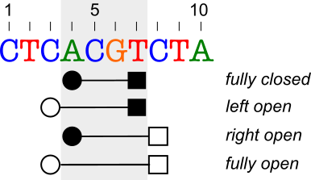

.. _rstexplanations:

===============
Building blocks
===============

This document describes concepts and building blocks of the Svart library. We start by explaining how Svart models
the genomic assembly and contigs. Then we explain concepts necessary for defining a (genomic) region.
Finally, we describe how Svart models genomic variation.

Genomic Assembly
~~~~~~~~~~~~~~~~

Svart adopts NCBI's representation of genomic assembly, with assembly consisting of assembly metadata and of
a collection of contigs.

There are three ways how to get a hold of a genomic assembly:
use the built-in assemblies, parse NCBI assembly report file, or create the assembly from scratch.

Built in Genomic Assemblies
###########################

Svart ships with several built-in genomic assemblies for *Homo sapiens* and *Mus musculus* organisms:

.. TODO - Make this a table?

* ``GRCh37.p13``
* ``GRCh38.p13``
* ``GRCm39``
* ``GRCm38.p6``

The assemblies are available in ``GenomicAssemblies`` class. Let's get our hands on the ``GRCh38.p13`` assembly::

  GenomicAssembly grch38p13 = GenomicAssemblies.GRCh38p13();

  System.out.println(grch38p13.name() + ':' + grch38p13.organismName());
  // prints `GRCh38.p13:Homo sapiens (human)`

NCBI assembly report file
#########################

Svart provides a parser to construct genomic assembly from NCBI's genomic assembly report file.

Let's read the `GRCm38.p6 assembly report`_  directly from NCBI's FTP site using the corresponding
RefSeq assembly accession ``GCF_000001635.26``::

  GenomicAssembly grcm38p6 = GenomicAssemblies.downloadAssembly("GCF_000001635.26");

  System.out.println(grcm38p6.name() + ':' + grcm38p6.organismName());
  // prints `GRCm38.p6:Mus musculus (house mouse)`

Alternatively, we can use ``GenomicAssemblyParser`` to parse the downloaded assembly report file::

  Path localAssemblyReport = Path.of("GCF_000001635.26_GRCm38.p6_assembly_report.txt")
  GenomicAssembly grcm38p6 = GenomicAssemblyParser.parseAssembly(Files.newInputStream(localAssemblyReport));

  System.out.println(grcm38p6.name() + ':' + grcm38p6.organismName());
  // prints `GRCm38.p6:Mus musculus (house mouse)`

From scratch
############

Svart lets you to create a fully customized genome assembly from provided inputs. As an example, let's create a toy
genomic assembly with metadata from ``GRCh38.p13`` containing the first 2 contigs of the assembly::

 List<Contig> contigs = List.of(
    Contig.of(1, "1", SequenceRole.ASSEMBLED_MOLECULE, "1", AssignedMoleculeType.CHROMOSOME, 248_956_422, "CM000663.2", "NC_000001.11", "chr1"),
    Contig.of(2, "2", SequenceRole.ASSEMBLED_MOLECULE, "2", AssignedMoleculeType.CHROMOSOME, 248_956_422, "CM000664.2", "NC_000002.12", "chr2"));
 GenomicAssembly assembly = GenomicAssembly.of("GRCh38.p13", "Homo sapiens (human)", "9606",
    "Genome Reference Consortium", "2019-02-28",
    "GCA_000001405.28", "GCF_000001405.39",
    contigs);

 System.out.println(assembly.name() + ':' + assembly.organismName());
 // prints `GRCh38.p13:Homo sapiens (human)`

Contig
~~~~~~

*Contig* is a contiguous segment of a nucleotide sequence. In Svart, we use *contig* to represent all types of chromosomes,
plasmids, unplaced/unlocalized scaffolds, alt-loci or patch scaffolds.

Contig is a "cornerstone" of the Svart's data model as it is essential for creation of many objects, such as genomic
regions, or variants.

The following table lists the contig attributes:

.. list-table:: Contig attributes
  :widths: 25 25 120
  :header-rows: 1

  * - Attribute
    - Type
    - Description
  * - *Id*
    - ``int``
    - A numeric id that is unique within the given genomic assembly. In human genomes, the id ``1`` is assigned
      to chromosome *1*, ``23`` to *X*, ``24`` to *Y*, ``25`` to *MT*, and the remaining IDs are used for any unplaced
      contigs scaffolds, etc. ``0`` is reserved as the *unknown* value. Within an assembly, the contigs are sorted by
      the id.
  * - *Name*
    - ``String``
    - Sequence-name of the assembly report file, e.g. *1-22*, *X*, *Y*, *MT*, *HSCHR1_CTG1_UNLOCALIZED*.
  * - *Length*
    - ``int``
    - The number of bases a contig consists of, a.k.a contig length.
  * - *GenBank Accession*
    - ``String``
    - GenBank sequence accession followed by version, e.g. *CM000663.2*.
  * - *RefSeq Accession*
    - ``String``
    - RefSeq sequence accession followed by version, e.g. *NC_000001.11*.
  * - *UCSC name*
    - ``String``
    - A name assigned to the contig by UCSC, e.g. *chr1*.
  * - *Sequence role*
    - ``SequenceRole``
    - The role the contig has in the assembly, e.g. *assembled molecule*, *unlocalized scaffold*, *unplaced scaffold*.
  * - *Assigned molecule and type*
    - ``String``, ``AssignedMoleculeType``
    - Assigned molecule may be a duplicate of the *name* field for chromosomes, but for unlocalised scaffolds, alt-loci,
      patches etc. will point to the chromosome on which they are located.

We can get the contigs from ``GenomicAssembly``, or we can create our own from scratch (useful for unit tests).

As an example, let's figure out the length of *chrM* in *GRCh38p13* assembly::

  GenomicAssembly GRCh38p13 = GenomicAssemblies.GRCh38p13();
  Contig mt = GRCh38p13.contigByName("MT");
  System.out.println(mt.length());
  // prints 16569

Coordinate Systems
~~~~~~~~~~~~~~~~~~

Now that we have learned about genomic assemblies and contigs, let's discuss an important topic of coordinate systems.
Coordinate system is used to describe start and end coordinates of a region. The coordinates are be either *included*
or *excluded*. Let's discuss the meaning on this using an example:

Let's suppose that we want to create an interval :math:`r` that spans the bases ``ACGT`` at positions *4..7*
of the sequence (shaded region).
Using *fully closed* coordinate system, where both start (full circle) and end (full square) coordinates
are *included* in the interval, we define the interval as :math:`r = [4,7]`.
When using *left open* coordinate system, where the start position is *excluded* and the end is included, we represent the
region as :math:`r = (3,7]`.
Note that we use square brackets ":math:`[`" to represent an included coordinate and round brackets ":math:`(`"
to represent an excluded coordinate.

.. TODO - can we add examples of domains where only one coordinate system is used?

Svart supports all coordinate systems
#####################################

As you can see, there are four possible coordinate systems we can use to define :math:`r`. In most domains, only one coordinate
system is used to represent intervals. However, this is not the case in bioinformatics, where both *zero based* and
*one based* coordinate systems are commonly being used. Based on our experience, there are many situations requiring
that require coordinate system conversion. Incorrect conversion which might lead to bugs and off-by-one errors,
which is one of the issues Svart aims to solve.

We designed Svart to handle both of these systems, all this being transparent to the user.
However, since we decided to support multiple coordinate systems, we also added support to all possible coordinate
systems, including *right open* and *fully open*. In result, we support all operations on intervals, such as
calculating overlaps, distances, regardless of the coordinate system.

Position vs. Coordinate
#######################

We want to make a clear distinction between a *position* and a *coordinate*. We use the term *position*
to denote a location of a single base on a contig. For example, the position of the only ``G`` in the image above is
``6``.
The *coordinate* is a *position* used to denote interval bound, and that is included or excluded in the interval,
depending on interval's coordinate system.

Genomic Region
~~~~~~~~~~~~~~

Genomic region represents a *zero or more* consecutive positions of a contig strand.
In Svart, a genomic region :math:`r` has the following invariants:

- once created, length of :math:`r` is the same regardless of strand or coordinate system.
- :math:`a \le b` where :math:`a` and :math:`b` are the start and end coordinates of :math:`r`. The only exception is
  an empty region in *fully closed* coordinate system, where :math:`b=a-1`

.. TODO -

Variant
~~~~~~~

Variant represents a change observed in the sample with respect to reference sequence in given locus. In Svart, variant
inherits all features of a genomic region. The region represents location of the variant's *ref* allele on the contig.
Therefore, it is very straightforward to perform any sort of calculations for variants, for instance computing distance
to transcripts.

Svart provides a single interface to represent *sequence*, *symbolic*, and *breakend* variants.

Sequence variant
################

Sequence variant describes a genomic variation where sequences of both *ref* and *alt* alleles
are known, available, and feasible to be included into the variant. Sequence variant is mainly used
to represent single nucleotide variants or short insertions/deletions, where the alleles are not very long, as storing
the allele sequences would spend a lot of memory, while it would essentially duplicate the information from
the reference genome files.

Sequence variant involves only a single contig.

Let's create a sequence variant representing `rs12345 <https://www.ncbi.nlm.nih.gov/snp/rs12345>`_::

  GenomicAssembly GRCh38p13 = GenomicAssemblies.GRCh38p13();
  Variant rs12345 = Variant.of(GRCh38p13.contigByName("22"), "rs12345",
                      Strand.POSITIVE, CoordinateSystem.oneBased(),
                      Position.of(25_459_492), "G", "A");

Symbolic variant
################

Symbolic variant describes a genomic variation where the complete sequences of *ref* and *alt* alleles are not part of the
variant definition and the sequence is replaced by a placeholder. Symbolic variant notation is mostly used to represent
variants that involve long stretches of genome.

Let's create an example of `nsv4172831 <http://dgv.tcag.ca/dgv/app/variant?id=nsv4172831&ref=GRCh38/hg38>`_ that
represents a deletion of 118 bases in the region *9:133,393,238-133,393,355*::

  Variant nsv4172831 = Variant.of(GRCh38p13.contigByName("9"), "nsv4172831",
                         Strand.POSITIVE, CoordinateSystem.oneBased(),
                         Position.of(133_393_237), Position.of(133_393_355),
                         "N", "<DEL>", -118);

Note that we need to record the coordinate of the preceding base (``N``) which is *not* part of the deletion, in order
to conform with the VCF conventions. Alternatively, we can write the same deletion without providing the *ref* allele as::

  Variant nsv4172831 = Variant.of(GRCh38p13.contigByName("9"), "nsv4172831",
                         Strand.POSITIVE, CoordinateSystem.oneBased(),
                         Position.of(133_393_238), Position.of(133_393_355),
                         "", "<DEL>", -118);

Note that now the coordinates match coordinates of the region *9:133,393,238-133,393,355* we started with.

Breakend variant
################

Breakend variants are modeled using two breakends that represent the novel adjacency.

.. TODO - write more and better

Variant trimming
~~~~~~~~~~~~~~~~

It is important to standardize variant representation using trimming. Svart allows to trim both sequence and symbolic
variants. There are two trimming directions - *left* and *right*. There are two strategies to deal with
the last common base - the base is either *retained* or *removed*.

.. TODO - write more and better

.. _GRCm38.p6 assembly report: ftp://ftp.ncbi.nlm.nih.gov/genomes/all/GCA/000/001/405/GCA_000001405.14_GRCh37.p13/GCA_000001405.14_GRCh37.p13_assembly_report.txt