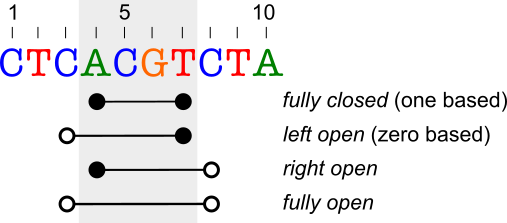

.. _rstexplanations:

===============
Building blocks
===============

This document describes concepts and building blocks of the Svart library. We start by explaining how the library models
the genomic assembly and contigs. Then we explain concepts that are necessary for defining a (genomic) region, including
coordinate system and strand. Finally, we describe how the library models genomic variation.

Genomic Assembly
~~~~~~~~~~~~~~~~

Svart adopts NCBI's representation of genomic assembly, where the assembly is a collection of
contigs with some metadata.

There are three ways how to get a hold of a genomic assembly: use get a built-in assembly, parse NCBI assembly report file, or
create the assembly from scratch.

Built in Genomic Assemblies
###########################

Svart ships with several built-in genomic assemblies for *Homo sapiens* and *Mus musculus* organisms:

.. TODO - Make this a table?

* ``GRCh37.p13``
* ``GRCh38.p13``
* ``GRCm39``
* ``GRCm38.p6``

The assemblies are available in ``GenomicAssemblies`` class. Let's get our hands on the ``GRCh38.p13`` assembly::

  GenomicAssembly grch38p13 = GenomicAssemblies.GRCh38p13();

  System.out.println(grch38p13.name() + ':' + grch38p13.organismName());
  // prints `GRCh38.p13:Homo sapiens (human)`

NCBI assembly report file
#########################

Svart provides a parser to construct genomic assembly from NCBI's genomic assembly report file.

Let's read the `GRCm38.p6 assembly report`_  from NCBI's FTP site using the corresponding RefSeq assembly accession
``GCF_000001635.26``::

  GenomicAssembly grcm38p6 = GenomicAssemblies.downloadAssembly("GCF_000001635.26");

  System.out.println(grcm38p6.name() + ':' + grcm38p6.organismName());
  // prints `GRCm38.p6:Mus musculus (house mouse)`

Alternatively, we can use ``GenomicAssemblyParser`` to parse the downloaded assembly report file::

  GenomicAssembly grcm38p6 = GenomicAssemblyParser.parseAssembly(Files.newInputStream(Path.of("GCF_000001635.26_GRCm38.p6_assembly_report.txt")));

  System.out.println(grcm38p6.name() + ':' + grcm38p6.organismName());
  // prints `GRCm38.p6:Mus musculus (house mouse)`

From scratch
############

Svart lets you to create a fully customized genome assembly from provided inputs. As an example, let's create a toy
genomic assembly with metadata from ``GRCh38.p13`` containing the first 2 contigs of the assembly::

 List<Contig> contigs = List.of(
    Contig.of(1, "1", SequenceRole.ASSEMBLED_MOLECULE, "1", AssignedMoleculeType.CHROMOSOME, 248_956_422, "CM000663.2", "NC_000001.11", "chr1"),
    Contig.of(2, "2", SequenceRole.ASSEMBLED_MOLECULE, "2", AssignedMoleculeType.CHROMOSOME, 248_956_422, "CM000664.2", "NC_000002.12", "chr2"));
 GenomicAssembly assembly = GenomicAssembly.of("GRCh38.p13", "Homo sapiens (human)", "9606",
    "Genome Reference Consortium", "2019-02-28",
    "GCA_000001405.28", "GCF_000001405.39",
    contigs);

 System.out.println(assembly.name() + ':' + assembly.organismName());
 // prints `GRCh38.p13:Homo sapiens (human)`

Contig
~~~~~~

*Contig* is a contiguous segment of a nucleotide sequence. In Svart, we use *contig* to represent all types of chromosomes,
plasmids, unplaced/unlocalized scaffolds, alt-loci or patch scaffolds.

Contig is a "cornerstone" of the Svart's data model as it is essential for creation of many objects, such as genomic
regions, or variants.

The following table lists the contig attributes:

.. list-table:: Contig attributes
  :widths: 25 25 120
  :header-rows: 1

  * - Attribute
    - Type
    - Description
  * - *Id*
    - ``int``
    - A numeric id that is unique within the given genomic assembly. In human genomes, the id ``1`` is assigned
      to chromosome *1*, ``23`` to *X*, ``24`` to *Y*, ``25`` to *MT*, and the remaining IDs are used for any unplaced
      contigs scaffolds, etc. ``0`` is reserved as the *unknown* value. Within an assembly, the contigs are sorted by
      the id.
  * - *Name*
    - ``String``
    - Sequence-name of the assembly report file, e.g. *1-22*, *X*, *Y*, *MT*, *HSCHR1_CTG1_UNLOCALIZED*.
  * - *Length*
    - ``int``
    - The number of bases a contig consists of, a.k.a contig length.
  * - *GenBank Accession*
    - ``String``
    - GenBank sequence accession followed by version, e.g. *CM000663.2*.
  * - *RefSeq Accession*
    - ``String``
    - RefSeq sequence accession followed by version, e.g. *NC_000001.11*.
  * - *UCSC name*
    - ``String``
    - A name assigned to the contig by UCSC, e.g. *chr1*.
  * - *Sequence role*
    - ``SequenceRole``
    - The role the contig has in the assembly, e.g. *assembled molecule*, *unlocalized scaffold*, *unplaced scaffold*.
  * - *Assigned molecule and type*
    - ``String``, ``AssignedMoleculeType``
    - Assigned molecule may be a duplicate of the *name* field for chromosomes, but for unlocalised scaffolds, alt-loci,
      patches etc. will point to the chromosome on which they are located.

We can get the contigs from ``GenomicAssembly``, or we can create our own from scratch (useful for unit tests).

As an example, let's figure out the length of *chrM* in *GRCh38p13* assembly::

  GenomicAssembly GRCh38p13 = GenomicAssemblies.GRCh38p13();
  Contig mt = GRCh38p13.contigByName("MT");
  System.out.println(mt.length());
  // prints 16569

.. TODO - unknown contig

Coordinate Systems
~~~~~~~~~~~~~~~~~~

.. TODO - aim of this section
- explain the contemporary coordinate systems used in genomics,
- how this is different from another domains (e.g. joda-time) where only a single coordinate system is allowed,
- difference between coordinates and positions,
- why we define all 4 possible coordinate systems

Now that we have learned about genomic assemblies and contigs, let's discuss an important topic of coordinate systems.
Coordinate system is used to describe start and end coordinates of a region. The coordinates are be either *included*
or *excluded*. Let's discuss the meaning on this using an example:

Let's suppose that we want to create an interval :math:`a` that spans the bases ``ACGT`` located at positions *4..7*
of the sequence (shaded region).
Using *fully closed* (one based) coordinate system, where both start (full circle) and end (full square) coordinates
are included in the interval, we define the interval as :math:`a = [4,7]`.
When using *left open* (zero based) coordinate system, the same region is represented as :math:`a = (3,7]`. Note that
we use square brackets ":math:`[`" to represent an included coordinate and round brackets ":math:`(`" to represent
an excluded coordinate.

As you can see, we can write down :math:`a`'s coordinates in four different ways. In most domains, only one coordinate
system is used to represent intervals.
.. TODO - can we add some examples?

However, there are two coordinate systems being extensively used in bioinformatics: *zero based* and *one based*. There
are situations when coordinates need to be converted from one system to another and sometimes people forget to account for
the different coordinate systems. All this might lead to bugs and off-by-one errors, which is exactly what Svart aims
to solve.

Lastly, we would like to make a clear distinction between a *position* and a *coordinate*. We use the term *position*
to denote a location of a single base on a contig. For example, the position of the only ``G`` in the image above is
``6``.
The *coordinate* is a *position* used to denote interval bound, and that is included or excluded in the interval,
depending on interval's coordinate system.

Genomic Region
~~~~~~~~~~~~~~

Genomic region represents a *zero or more* consecutive positions on particular *strand* of a contig.
Once created, length of the region is the same irrespective of strand or coordinate system.

.. TODO -

Variant
~~~~~~~

.. _GRCm38.p6 assembly report: ftp://ftp.ncbi.nlm.nih.gov/genomes/all/GCA/000/001/405/GCA_000001405.14_GRCh37.p13/GCA_000001405.14_GRCh37.p13_assembly_report.txt